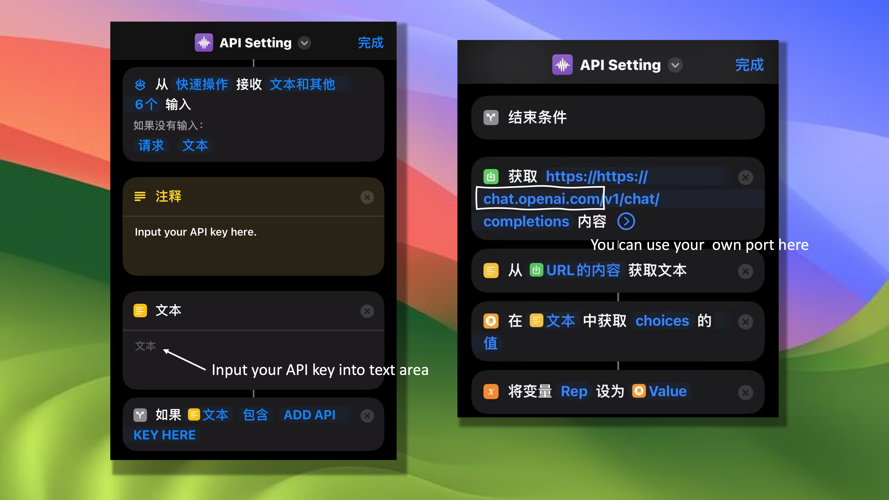
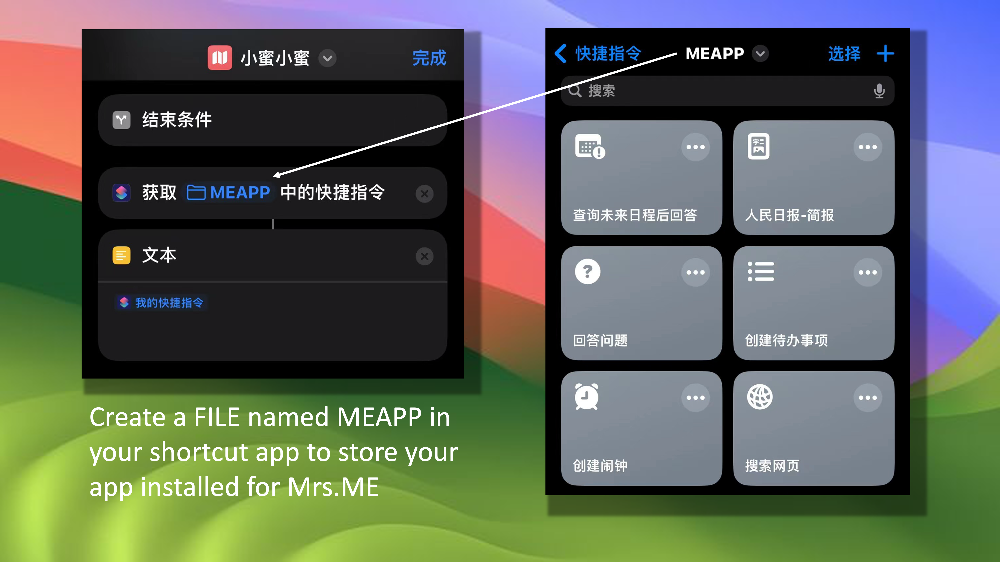

# Mrs.ME Applications Store

## Introduction

Mrs.ME is an extensible voice assistant built on the ChatGPT API in Shortcut for IOS/MacOS. This repository contains all the apps we currently release, as well as download and usage instructions.

## Why Mrs.ME？

- Better semantic understanding ability than Siri, helping you complete more complex tasks.
- More customized, complete your custom voice assistant commands.

## Installation

You need to install several shortcuts to complete our function:

1. [API key Setting](https://www.icloud.com/shortcuts/d9ab509c43eb460b884eb2eac02db76c)
2. [Mrs.ME](https://www.icloud.com/shortcuts/a31c70d6a4494c7495e80370bd2f27c6) (Change the Shortcut name, if you want to call it by different name)

3. [Applications](https://github.com/MaktubCN/Mrs.ME-Applications-Store/tree/main/applications) (See applications file in Github)
4. [Manage installed applications](Manage installed applications)

## Developer

If you want to develop, you only need to make simple modifications to our [APP Template](https://www.icloud.com/shortcuts/1121a499aba24f6588d0c68a16e0b68c).
